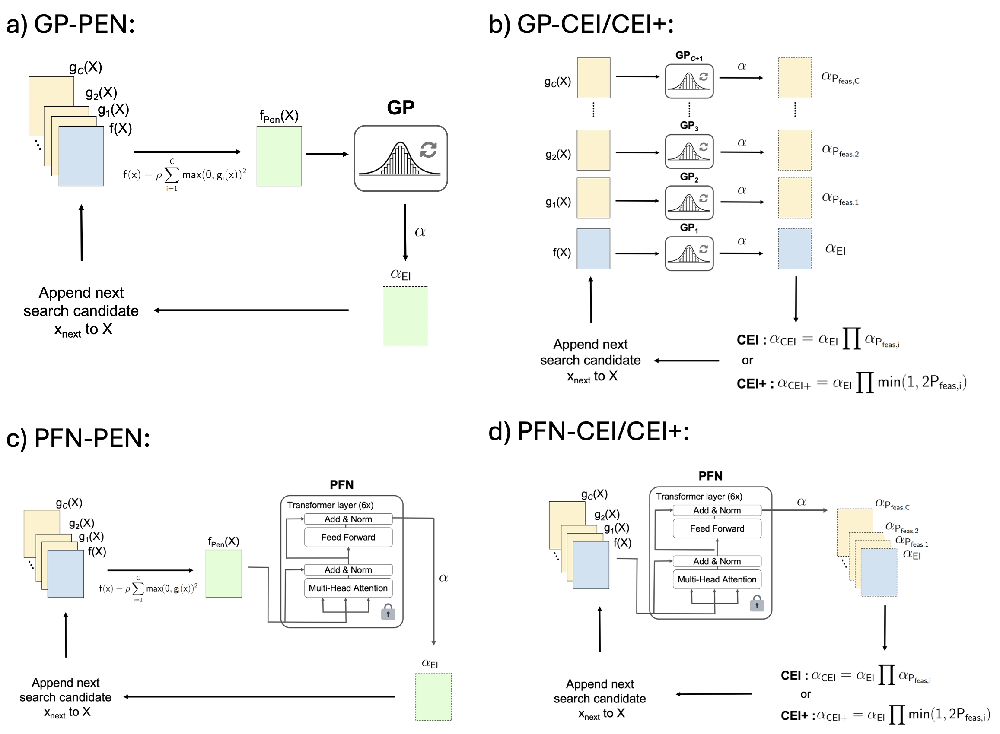

# PFN-CEI: A Pre-Trained Transformer-Based Constrained Bayesian Optimization Algorithm

## Citation


## Overview
We introduce fast and accurate constrained Bayesian optimization (CBO) algorithms using a prior-data fitted network ([PFN](https://github.com/automl/PFNs4BO)) as a surrogate and compare with the state-of-the-art Bayesian optimization (BO) library [Botorch](https://github.com/pytorch/botorch) using Gaussian Processes (GP). Our PFN-CEI framework exploits the transformer architecture of a prior-data fitted network (PFN) for calculating constrained expected improvement as BO's acquisition function, enabling batch processing the calculation of the objective's expected improvement and the probability of feasibility of the constraint in parallel. Tutorials on performing constrained Bayesian Optimization (CBO) using 3 different constraint-handling techniques and 2 surrogates are included.

To foster collaborative progress, we also put our constrained test problem set and corresponding code in this repo under the "test_functions" folder. 

## CBO algorithms
The tutorials show you how to use three constraint-handling methods on PFN-based and GP-based CBO in total 6 algorithms we highlighted in our paper. Here is the tutorial on using the six algorithms:

1. `Tutorial_PFN_Pen.ipynb`: PFN-based BO with a penalty function on the objective.
2. `Tutorial_PFN_CEI.ipynb`: PFN-based BO with constrained expected improvement (CEI) as acquisition function.
3. `Tutorial_PFN_CEI_plus.ipynb`: PFN-based BO with thresholded constrained expected improvement (CEI+) as acquisition function.
4. `Tutorial_GP_Pen.ipynb`: GP-based BO with a penalty function on the objective.
5. `Tutorial_GP_CEI.ipynb`: GP-based BO with constrained expected improvement (CEI) as acquisition function.
6. `Tutorial_GP_CEI_plus.ipynb`: GP-based BO with thresholded constrained expected improvement (CEI+) as acquisition function.



## Test problems
We provided 15 test optimization problems for benchmarking BO methods. The way of using it is shown in Test_function_example.ipynb and here:
```
import torch
import numpy as np

# Select your test case
from test_functions.Ackley2D import Ackley2D, Ackley2D_Scaling

# Initialized sample in the correct dimension based on the test case
# The test case need to have X in [0,1]
X = torch.rand(20,2)

# Scale the X in [0,1] to the domain of interest
X_scaled = Ackley2D_Scaling(X)

# The test case output the gx (constaint) and fx (objective)
gx, fx = Ackley2D(X_scaled)
```
